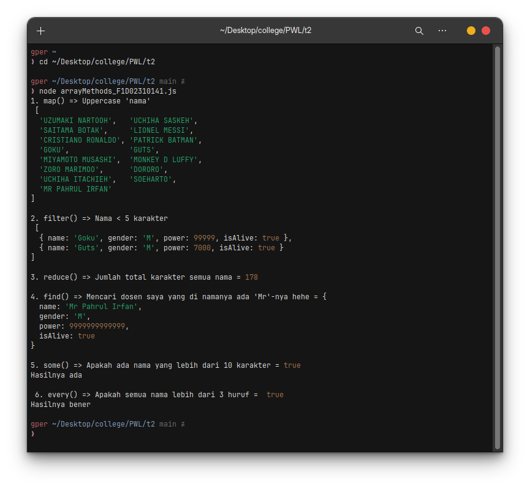

# Tugas 2 Pemrograman Web Lanjut

**Nama**: UMAM ALPARIZI<br>**NIM**: F1D02310141

---


> [!info]
> Penugasan ini merupakan contoh pengguaan _built in function_ dari Javascript versi terbaru seperti `map()`, `filter()`, `reduce()`, `find()`, `some()`, dan `every()`.


### Implementasi

Contoh implementasi bisa dilihat pada file `arrayMethods_F1D02310141.js`. Di situ saya mencoba menggunakan keenam fungsi tersebut sesuai dengan ketentuan penugasan. Sebagai informasi, saya menggunakan _arrow function_ dalam mengimplementasikan keenam fungsi itu supaya terlihat lebih pendek dan lebih *keren* hehe.
##### 1. `map()`

Fungsi `map()` pada kode betujuan merubah semua nama karakter menjadi _uppercase_ (huruf besar semua) dengan memanfaatkan fungsi `toUpperCase()`. Kurang lebih seperti ini:

```javascript
"umam".toUpperCase() // "UMAM"
```

##### 2. `filter()`

Fungsi `filter()` pada kode sesuai namanya betujuan untuk menyaring suatu array berdasarkan kriteria tertentu. Pada kode, dicari yang namanya kurang dari 5 karakter. Kurang lebih seperti ini begini untuk mendapatkan panjang string:

```javascript
"umam".length // 4
```

##### 3. `reduce()`

Fungsi `reduce()` pada kode digunakan untuk menjumlahkan semua total panjang semua karakter. Terdapat 2 argumen yang dapat dikirmkan saat memanggi fungsi ini yaitu akumulator dan nilai saat ini seprti yang saya gunakan pada kode, sederhananya begini:

```javascript
[1, 2, 3].reduce((acc, curr) => acc + curr, 0) // hasilnya 6
```
*Angka 0 menandakan dari mulai berapa akan dijumlahkan.

##### 4. `find()`

Fungsi `find()`  pada kode digunakan untuk menemukan data berdasarkan kriteria terentu, pada kasus di atas adalah yang mengandung 'Mr' pada namanya memanfaatkan fungsi `includse('Mr')`. Namun perlu diperhatikan bahwa funsgsi ini hanya akan mengembalikan satu elemen array walau dari data array punya banyak data yang mengandung 'Mr', artinya hanya elemen yang pertama kali ditermukan yang akan dikembalikan. Contoh sederhanya seperti:

```javascript
['satu', 'dua', 'tiga'].find(e => e.includes('a')) // hasilnya 'satu'
```

##### 5. `some()`

Fungsi `some()` akan mengembalikan nilai boolean berdasarkan suatu kriteria, pada kode yang ditanya apakah ada nama yang lebih dari 10 karakter.

Contoh penggunaanya seperti:

```javascript
["satu", "dua"].some(e => e.lenth > 10) // false
```

##### 6. `every()`

Fungsi ini pada kode digunakan untuk mengecek apakah semua panjang nama lebih dari 3 karakter. Contoh format kode:

```javascript
array.every(e => e.name.length > 3)
```

### Hasil dan Kesimpulan



Metode seperti `map()`, `filter()`, `reduce()`, `find()`, `some()`, dan `every()` masing-masing punya tujuan spesifik untuk memudahkan kita dalam mengolah data. `map()` dipakai untuk membuat array baru dengan hasil transformasi dari setiap elemen, sedangkan `filter()` menghasilkan array baru berisi elemen yang lolos kondisi tertentu. `reduce()` mengakumulasi seluruh elemen menjadi satu nilai akhir, `find()` mencari elemen pertama yang sesuai syarat, `some()` mengecek apakah ada minimal satu elemen yang memenuhi kondisi, dan `every()` memastikan semua elemen memenuhi kriteria.

Kesimpulannya, memang agak sedikit ribet membedakan keenam fungsi itu, tapi  dengan memahami perbedaan ini, kita bisa memilih metode yang paling sesuai agar logika lebih jelas, efisien, dan mudah dibaca.
